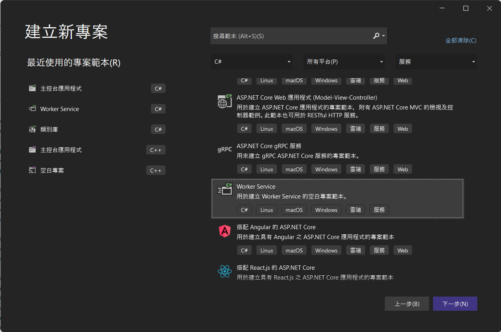

# Mjpeg.Provider.NET([中文](./README.md)|English)
[](https://www.nuget.org/packages/Mjpeg.Provider.NET)

This package can help us convert images to MJPEG Stream and push to browser or application.

## How to use
1. Dependency injection
    ```
    # Parameter 1: Set the image format of the image data.
    # Parameter 2: The default picture position, if the user pulls a stream that does not exist, this picture will be displayed.
    services.AddAdvancedMJPEGProvider(PixelFormat.BGR, Path.Combine(AppDomain.CurrentDomain.BaseDirectory, "Images", "NoSignal.jpg"));
    ```
1. Create a Controller to provide users with streaming
    ```
    [Route("api/[controller]")]
    [ApiController]
    public class LiveViewController : ControllerBase
    {
        private readonly MjpegProvider provider;

        public LiveViewController(MjpegProvider provider)
            => this.provider = provider;

        /// <summary>
        /// https://localhost:5001/api/LiveView/Stream?Id=15d07bca-864a-48cc-9c48-6c1734e09f49&fps=15&longSize=720&drawBoundingBox=true
        /// </summary>
        /// <param name="Id"> Stream id </param>
        /// <param name="fps"> Output fps </param>
        /// <param name="longSize"> Set the longest side for equal scaling </param>
        /// <param name="drawBoundingBox"> Whether to draw a bounding box </param>
        /// <returns></returns>
        [HttpGet]
        [Route("Stream")]
        public IActionResult Stream(Guid Id, int fps = 15, int longSize = default, bool drawBoundingBox = false)
            => provider.GetMJPEGActionResult(Id, fps, longSize, drawBoundingBox);
    ```
1. Push stream
    ```
    private readonly AdvancedMJPEGProvider advancedMJPEGProvider;

    a. Create a streaming channel
    # Parameter 1: Stream Id
    advancedMJPEGProvider.CreateChannel(Id);

    b. start inserting image
    # Parameter 1: Stream Id
    # Parameter 2: byte array, Pixel data
    # Parameter 3: int, Width
    # Parameter 4: int, Height
    advancedMJPEGProvider.UpdateChannelImage(Id, imageData, width, height);

    c. delete streaming channel
    # Parameter 1: Stream Id
    advancedMJPEGProvider.RemoveChannel(Id);

    d. Reset streaming image to default
    # Parameter 1: Stream Id
    advancedMJPEGProvider.SetDefaultImage(Id);
    ```
1. Setting bounding box
    ```
    # Parameter 1: Color: new Color(R, G, B), fill in the value of rgb
    # parameter 2: brush width
    # Parameter 3: The coordinate set of the line: new PointF(X, Y)
    public record BoundinxBox(Color Color, float Thickness, PointF[] Points);

    b. Set the Bounding box of streaming
    # Parameter 1: Stream Id
    # Parameter 2: IEnumerable<BoundingBox>, a collection of BoundingBox
    advancedMJPEGProvider.SetBoundingBox(Id, boundingBoxInfos);
    ```

## [Example introduction](./Mjpeg.Provider.Example/)
1. Create a project using the `Worker Service` project template
    
1. Installation package
    ```
    dotnet add package Microsoft.Extensions.Hosting
    dotnet add package Mjpeg.Provider.NET
    ```
1. Create [Startup.cs](./Mjpeg.Provider.Example/Startup.cs)，and add the following. (Note: Please prepare a photo for use when the connected stream does not exist)
    ```
    public class Startup
    {
        public Startup(IConfiguration configuration)
        {
            Configuration = configuration;
        }

        public IConfiguration Configuration { get; }

        // This method gets called by the runtime. Use this method to add services to the container.
        public void ConfigureServices(IServiceCollection services)
        {
            services.AddControllers();
            services.MjpegProvider(PixelFormat.BGR, Path.Combine(AppDomain.CurrentDomain.BaseDirectory, "Resouce", "NoSignal.jpg"));
        }

        // This method gets called by the runtime. Use this method to configure the HTTP request pipeline.
        public void Configure(IApplicationBuilder app, IWebHostEnvironment env)
        {
            if (env.IsDevelopment())
            {
                app.UseDeveloperExceptionPage();
            }

            app.UseHttpsRedirection();

            app.UseRouting();

            app.UseAuthorization();

            app.UseEndpoints(endpoints =>
            {
                endpoints.MapControllers();
            });
        }
    }
    ```
1. Add the `Controllers` folder, create [LiveViewController.cs](./Mjpeg.Provider.Example/Controllers/LiveViewController.cs), and add the following content.
    ```
    [Route("api/[controller]")]
    [ApiController]
    public class LiveViewController : ControllerBase
    {
        private readonly MjpegProvider provider;

        public LiveViewController(MjpegProvider provider)
            => this.provider = provider;

        /// <summary>
        /// https://localhost:5001/api/LiveView/Stream?Id=15d07bca-864a-48cc-9c48-6c1734e09f49&fps=15&longSize=720&drawBoundingBox=true
        /// </summary>
        /// <param name="Id"> Stream id </param>
        /// <param name="fps"> Output fps </param>
        /// <param name="longSize"> Set the longest side for equal scaling </param>
        /// <param name="drawBoundingBox"> Whether to draw a bounding box </param>
        /// <returns></returns>
        [HttpGet]
        [Route("Stream")]
        public IActionResult Stream(Guid Id, int fps = 15, int longSize = default, bool drawBoundingBox = false)
            => provider.GetMJPEGActionResult(Id, fps, longSize, drawBoundingBox);
    }
    ```
1. Insert image in [Worker.cs](./Mjpeg.Provider.Example/Worker.cs)
1. Run the project and use the browser to play the stream. `https://localhost:5001/api/LiveView/Stream?Id=15d07bca-864a-48cc-9c48-6c1734e09f49&fps=15&longSize=720`

