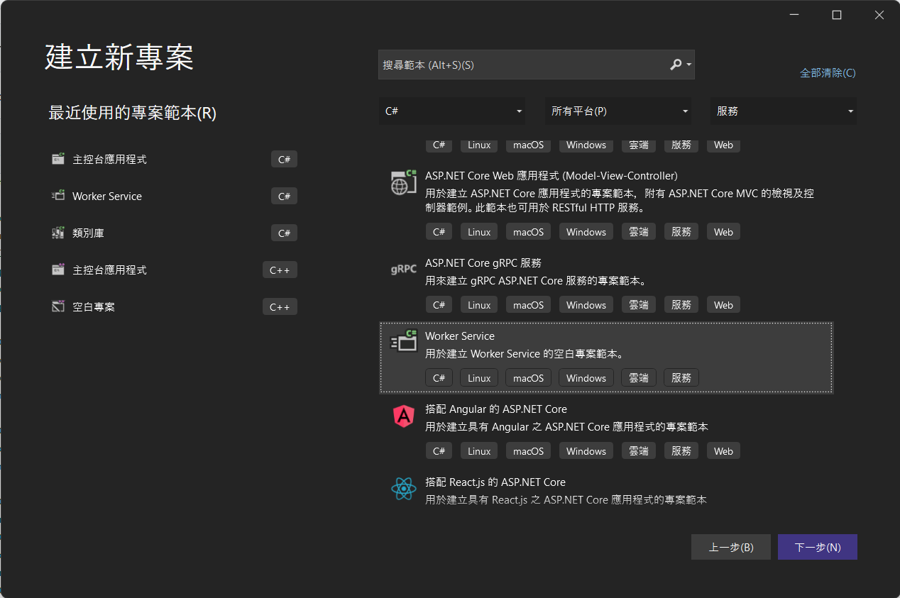

# Mjpeg.Provider.NET
[](https://www.nuget.org/packages/Mjpeg.Provider.NET)

這個套件可以幫助我們將照片轉換成 MJPEG Stream，推送到瀏覽器或者應用程式

## 如何使用
1. 相依性注入
    ```
    # 參數1: 設定之後傳入影像資料的影像格式。
    # 參數2: 必須放入一張預設圖片位置，如果使用者拉到不存在的串流會顯示這張圖片。
    services.AddAdvancedMJPEGProvider(PixelFormat.BGR, Path.Combine(AppDomain.CurrentDomain.BaseDirectory, "Images", "NoSignal.jpg"));
    ```
1. 創建一個 Controller 給使用者拉串流
    ```
    [Route("api/[controller]")]
    [ApiController]
    public class LiveViewController : ControllerBase
    {
        private readonly MjpegProvider provider;

        public LiveViewController(MjpegProvider provider)
            => this.provider = provider;

        /// <summary>
        /// https://localhost:5001/api/LiveView/Stream?Id=15d07bca-864a-48cc-9c48-6c1734e09f49&fps=15&longSize=720&drawBoundingBox=true
        /// </summary>
        /// <param name="Id"> Stream id </param>
        /// <param name="fps"> Output fps </param>
        /// <param name="longSize"> Set the longest side for equal scaling </param>
        /// <param name="drawBoundingBox"> Whether to draw a bounding box </param>
        /// <returns></returns>
        [HttpGet]
        [Route("Stream")]
        public IActionResult Stream(Guid Id, int fps = 15, int longSize = default, bool drawBoundingBox = false)
            => provider.GetMJPEGActionResult(Id, fps, longSize, drawBoundingBox);
    ```
1. 推串流
    ```
    private readonly AdvancedMJPEGProvider advancedMJPEGProvider;

    a. 建立串流通道
    # 參數1: 串流 Id
    advancedMJPEGProvider.CreateChannel(Id);

    b. 開始塞照片
    # 參數1: 串流 Id
    # 參數2: byte array，Pixel data
    # 參數3: int，Width
    # 參數4: int，Height
    advancedMJPEGProvider.UpdateChannelImage(Id, imageData, width, height);

    c. 刪除串流通道
    # 參數1: 串流 Id
    advancedMJPEGProvider.RemoveChannel(Id);

    d. 重設串流影像
    # 參數1: 串流 Id
    advancedMJPEGProvider.SetDefaultImage(Id);
    ```
1. 設定 Bounding box
    ```
    # 參數1: 顏色: new Color(R, G, B) 填入 rgb 的值
    # 參數2: 畫筆寬度
    # 參數3: 線的座標集合: new PointF(X, Y)
    public record BoundinxBox(Color Color, float Thickness, PointF[] Points);

    b. 設定串流的 Bounding box
    # 參數1: 串流 Id
    # 參數2: IEnumerable<BoundingBox>，BoundingBox的集合
    advancedMJPEGProvider.SetBoundingBox(Id, boundingBoxInfos);
    ```

## [範例介紹](./Mjpeg.Provider.Example/)
1. 建立專案類型為 `Worker Service` 的專案
    
1. 安裝套件
    ```
    dotnet add package Microsoft.Extensions.Hosting
    dotnet add package Mjpeg.Provider.NET
    ```
1. 建立 [Startup.cs](./Mjpeg.Provider.Example/Startup.cs)，並新增以下內容。(備註:請準備一張照片，用於連線的串流不存在時使用)
    ```
    public class Startup
    {
        public Startup(IConfiguration configuration)
        {
            Configuration = configuration;
        }

        public IConfiguration Configuration { get; }

        // This method gets called by the runtime. Use this method to add services to the container.
        public void ConfigureServices(IServiceCollection services)
        {
            services.AddControllers();
            services.MjpegProvider(PixelFormat.BGR, Path.Combine(AppDomain.CurrentDomain.BaseDirectory, "Resouce", "NoSignal.jpg"));
        }

        // This method gets called by the runtime. Use this method to configure the HTTP request pipeline.
        public void Configure(IApplicationBuilder app, IWebHostEnvironment env)
        {
            if (env.IsDevelopment())
            {
                app.UseDeveloperExceptionPage();
            }

            app.UseHttpsRedirection();

            app.UseRouting();

            app.UseAuthorization();

            app.UseEndpoints(endpoints =>
            {
                endpoints.MapControllers();
            });
        }
    }
    ```
1. 新增 `Controllers`資料夾，並建立 [LiveViewController.cs](./Mjpeg.Provider.Example/Controllers/LiveViewController.cs)，然後新增以下內容。
    ```
    [Route("api/[controller]")]
    [ApiController]
    public class LiveViewController : ControllerBase
    {
        private readonly MjpegProvider provider;

        public LiveViewController(MjpegProvider provider)
            => this.provider = provider;

        /// <summary>
        /// https://localhost:5001/api/LiveView/Stream?Id=15d07bca-864a-48cc-9c48-6c1734e09f49&fps=15&longSize=720&drawBoundingBox=true
        /// </summary>
        /// <param name="Id"> Stream id </param>
        /// <param name="fps"> Output fps </param>
        /// <param name="longSize"> Set the longest side for equal scaling </param>
        /// <param name="drawBoundingBox"> Whether to draw a bounding box </param>
        /// <returns></returns>
        [HttpGet]
        [Route("Stream")]
        public IActionResult Stream(Guid Id, int fps = 15, int longSize = default, bool drawBoundingBox = false)
            => provider.GetMJPEGActionResult(Id, fps, longSize, drawBoundingBox);
    }
    ```
1. 在 [Worker.cs](./Mjpeg.Provider.Example/Worker.cs) 中插入圖片
1. 執行專案，並使用瀏覽器播放串流 `https://localhost:5001/api/LiveView/Stream?Id=15d07bca-864a-48cc-9c48-6c1734e09f49&fps=15&longSize=720`
